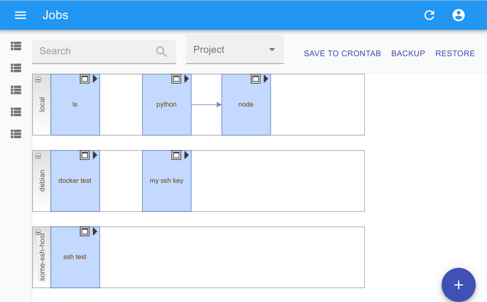

# GenghisTask - Workspace

GenghisTask the task scheduler. This is your workspace, the first part of the application : A remote git repository where the source code of each task will be under version control.

## What is it ?

GenghisTask is an open source, lightweight and secured replacement for tools such as [Jenkins](https://www.jenkins.io/), [Visual-tom](https://www.absyss.com/) or [Crontab UI](https://lifepluslinux.blogspot.com/2015/06/crontab-ui-easy-and-safe-way-to-manage.html). These tools are already nice CIs or schedulers and in GenghisTask, you will find again their traditional use case :
- Launch a periodic rsync backup of a folder
- Manage tasks with an UI, know what's going on and debug without hassle



New use cases :
- I need to launch my collection of usefull script on demand unscheduled
- I need a centralized way to manage the several crontab and tasks of several server
- I need rollback, version control and continuous integration of the new tasks
- I have security concerns and should no be able to inject arbitrary code into a crontab via a web ui
- I need to launch the task via HTTP as a Hook (or as a Lambda)
- I need to run a script in any language, even if the scheduler source code is in an other language.


## How to use it ?

The easiest way is to [fork this project](https://github.com/GenghisTask/Management/fork) and run : 

```docker run -p 3000:3000 -v /var/run/docker.sock:/var/run/docker.sock  -e GIT_BRANCH=main -e GIT_REPO='https://github.com/GenghisTask/Workspace.git' --network=host --rm genghistask/ui:1.3```

Remember to change GIT_REPO url to match your fork, for example : GIT_REPO='ssh://git@github.com/YouGit/Workspace.git'

## Configure

You can use right away the webapp http://127.0.0.1:3000/#/Graphs, but it's best to configure it properly (mainly create a ssh key pair) to be able to save your modifications. If you do not fork and change GIT_REPO url to match your fork like GIT_REPO='ssh://git@github.com/YouGit/Management.git' you may not be able to save your modifications, tasks, schedule, etc...

If you start the application for the first time, the webapp http://127.0.0.1:3000/#/Graphs reveals three tasks. You can run the task in order to configure the application if you don't want to do it manually.
1/ You need to create a ssh key pair for the app. Run the first task (start arrow on the graph) to generate a key. Retrieve the public key from the stdout log file and add it to the remote git repository fork.
2/ Check if the remote git repository url is well configured and if it accepts the key. Run the second task. Control the STDERR file for this second task. 
3/ Override this first time configuration with the content of the remote git repository, run the third task.


## Create your own task

You cannot inject code within the task scheduler directly (if you can, please file an issue, you discovered a vulnerability, congratulation). 

1/ For safety reason, you need to commit here, in the shell folder, a script first. If the remote git repository is a Github, Gitlab, Gogs or Gitea it should be easy to add some new file with their web editor.
2/ Pull the script into the application, using the "Restore" button
3/ The script file should now be listed when you will create or update a job.


## Run a task remotely

By default, all task are run locally, but is is possible to specify a remote environment where the task should be executed.


### Run through a ssh connection

It is possible to define a ssh host where a task can be executed.

You cannot define an ssh remote within the task scheduler directly.
1/ For safety reason, you need to edit the ssh/config file first in the environment folder of the git repository.
2/ Pull the config file into the application, using the "Restore" button
3/ The ssh remote should now be listed as environment.
4/ Remember to also add the public ssh key of the app to the ssh server.

### Run a task inside a docker container

It is possible to define an docker container image where a task can be executed.

You cannot define a docker image within the task scheduler directly.
1/ For safety reason, you need to add the image as service in the docker-compose file first in the git repository
2/ Pull the config file into the application, using the "Restore" button
3/ The docker image should now be listed as environment.
